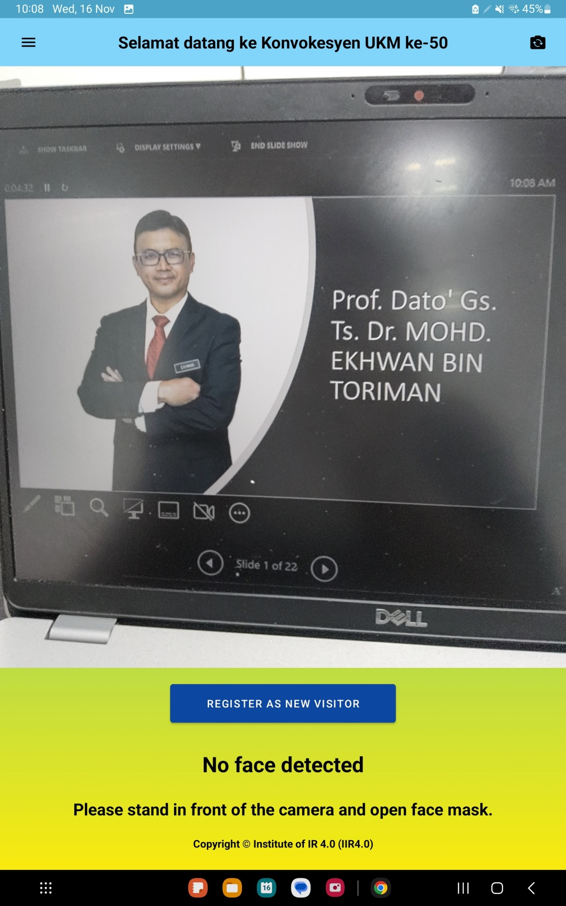
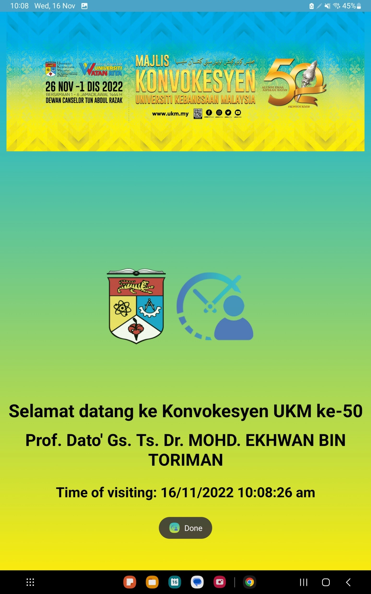
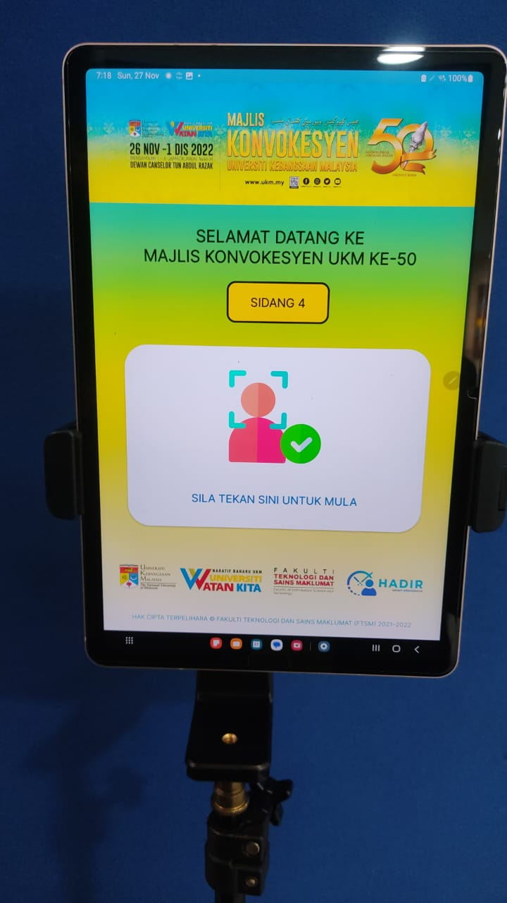

# Face Recognition based Biometric Authentication System for UKM Convocation 2022

UKM_Face_Recognition_Convocation_22 is developed utilizing the pretrained MobileFaceNets model for UKM convocation 2022. The frontend is developed using android studio (java) and react.js for backend. This project recognize visitors accurately and complete biometric authentication for visitors. Visitors facial images were added prior to the event.

## Key Features 
- Fast and very accurate.
- No re-training required to add new Faces.
- Save Recognitions for further use.
- Real-Time and offline.
- Simple UI.

## Tools and Frameworks used:
- Android Studio (Java)
- CameraX
- ML Kit
- TensorFlow Lite
- React.js (Not included in this repository, for copyright issues)

## Model 
- MobileFaceNet : [Research Paper](https://arxiv.org/ftp/arxiv/papers/1804/1804.07573.pdf)
- [Implementation](https://github.com/sirius-ai/MobileFaceNet_TF)

## Usage
<table>
  <tr>
    <td><b>1.Capture Live Facial Image</b></td>
     <td><b>2.Recognize the Face</b></td>
     <td><b>3.Implementation</b></td>
     
  </tr>
  <tr>
    <td></td>
  <td></td>
    <td></td>
  
  </tr>
 </table>
 
 Copyright @ Institute IR4.0 (IIR4.0)
